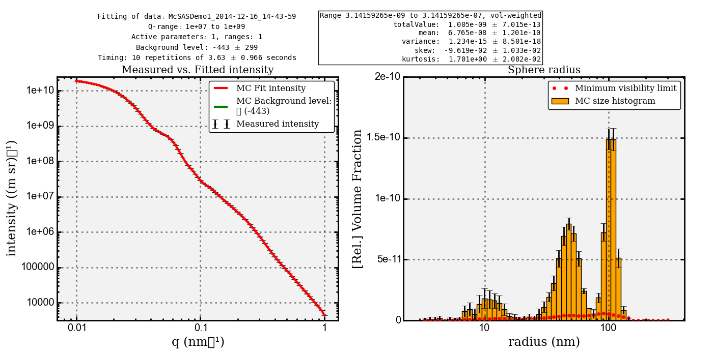
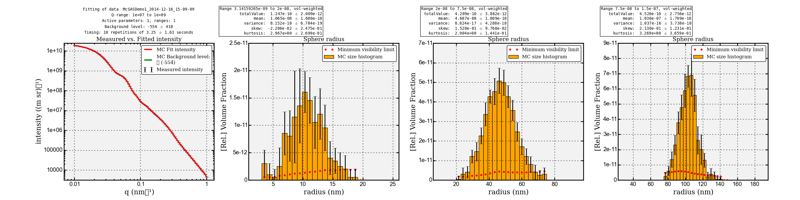

.. Find the reST syntax at http://sphinx-doc.org/rest.html

***********************
McSAS Quick Usage guide
***********************

Introduction
============

This guide is intended as an aid to getting the first fits using McSAS. 

For comprehensive details of what goes on under the hood, please refer as a 
baseline to the available publications. Additionally, the code is open source, 
and provides the best "documentation" of what actually takes place.

When publishing results using this code, the user is requested to cite either or 
both of the following works:

    Bressler, I, Pauw, B. R, and Thuenemann, A., submitted to J. Appl. Cryst., 
        arXiv:1412.1900

    Pauw, B. R., Pedersen, J. S., Tardif, S., Takata, M. and Iversen, B. B.,
        J. Appl. Cryst. 46 (2013), 365—371.

Scope of the code capabilities
------------------------------

The McSAS code at the moment can:

    1. Fit supplied data to a variety of models, with absolute unit support.
    2. Graphically show the distributions of selected parameters and associated 
       parameter ranges.
    3. Graphical output includes distribution population modes with uncertainties.
    4. Output the fit, data, settings, and distributions for further processing.
    5. Can be used with or without user interface, using command-line arguments. 

-1. Starting McSAS
================================

McSAS can be used on both Linux / Unix systems (including MacOS X) as well as 
personal computers running Windows. 

On Unix- and Unix-like computers, McSAS can be started from any terminal by typing: 
	$ /path/to/mcsas/main.py

On Windows, the compiled executable can be double-clicked to start. 

0. Loading test data
====================

A demonstration dataset has been simulated using SASFit, and output in a 
three-column file: "testdata/quickstartdemo1.csv".

The dataset can be loaded by right-clicking in the empty list in the 
"Data Files"-tab. 
When loaded, the list shows some information of the data: its length, content, 
q-limits, and scatterer radius limits calculated using the Q limits 
(theoretically, the spacing between Q-points also dictates the size limits, but
the tendency of users to use much too narrowly-spaced Q-points would result in 
unworkable estimates).

Lastly, the "log"-window shows how many datapoints had an uncertainty estimate 
below 1% of the intensity. These datapoint uncertainty values have been adjusted
to 1%, as that is a practically demonstrated limit of SAS data accuracy. 

1. Configuring the algorithm 
============================
The algorithm uses several internal parameters. Some of these can be adjusted 
in the "Algorithm"-tab of the user interface. They are: 
  1. The convergence criterion. If the uncertainty estimates provided with the 
     data are not accurate, or if the fitting model chosen is unsuitable or 
     incompletely descriptive, the algorithm may not arrive at a final solution
     (a convergence criterion of 1 or below). 
  2. Number of repetitions from which uncertainties are determined. Set to 10 
     for the quick start. 
  3. Number of contributions. This can be adjusted to minimise the optimization
     time. The average optimisation time can be found in the "Timing" line on 
     the graphical output. 
  4. Background (checkbox). When set, it will add a flat background contribution
     to the fit

If necessary, the other internal algorithm parameters can be changed through 
careful editing of the "mcsasparameters.json" parameter dictionary. This should 
not be needed for common use. 

2. Configuring the Model
========================
For the quick start, the model selected should be the "Sphere" model. 
After selecting this model, verify that the sphere radius is "Active", then move
back to the "Data files"-tab, and double-click the "quickstartdemo1"-line to 
copy the sphere size estimates to the model. 

3. Configuring the Post-fit Analysis
====================================
Select the already filled lines in the "Post-fit Analysis"-tab, and select
"remove" from the right-click menu. 
Then add a new entry to the list by selecting "add range" from the right-click
menu. In the emerging window, change the histogram X-axis scaling from "lin" to
"log" and click "add".

The settings are now complete.

4. Running the fit
==================
Click the "start"-button. Optimisation takes 36 seconds on a 3.4 GHz intel i7 
iMac (2012 model). 

5. The result
=============
The result window should pop up automatically and resemble the plot shown in 
*quickstartdemo1.pdf*

    
The left-hand plot shows the data in black with error bars, the MC fit in red, 
and a green line indicating the fitted background level (not shown as it 
approaches zero). The background value is furthermore indicated in the legend.

The right-hand plot shows the resulting volume-weighted size histogram, with 
uncertainties on the bars, and the red dashed line indicating the minimum level 
required for each bin to contribute a measurable amount to the scattering 
pattern (i.e. more than the uncertainty).

As is clear from the vertical axis on that plot, the partial volume fractions 
are unrealistic if the scattering contrast has not been set. One may also want 
to rebin the plot in fewer bins to reduce the relative uncertainties on the 
bins.

5. Getting peak parameters
==========================
Above the size distribution, the population statistics can be found suhc as the 
mean, the variance, skew and kurtosis (each with their own uncertainty 
estimates). These are valid for the entire range, and are calculated from the
individual contributions (not from the histogram). 
If we want to find the values for the individual populations, we need to set the
correct ranges in the Post-fit Analysis list: 
    1. 3.14 - 20, (binning e.g. 20 bins, linearly spaced, volume-weighted)
    2. 20  -  75, (binning for example as above)
    3. 75  - 150, (ibid.)

And then pressing "start" again. (This restarts the fitting procedure. A 
"Re-analyze"-option is in the works but was not finished at the time of writing)

This should give the following figure (as shown in *quickstartdemo1a.pdf*):

The mean of each population is slightly shifted upward as compared to the 
simulation parameters (given in paragraph 8). Note, however, that the 
simulation parameters define the *numeric* mean, whereas the ones shown in 
the histogram are the *volumetric* mean. Therefore, the latter are shifted up.

6. Further results
==================

In the directory that the "quickstartdemo1.csv"-file was located, you will find
several more files after a successful fit. These are the automatically saved 
results. They all contain a timestamp on when the fit was performed. 
Files with an asterisk are only present if the fit was successful. They are:
  1. quickstartdemo1_[timestamp].pdf*: the autosaved plot
  2. quickstartdemo1_[timestamp]_log.txt: the fitting log window.
  3. quickstartdemo1_[timestamp]_contributions.pickle*: A pickled list of raw 
     contributions.
  4. quickstartdemo1_[timestamp]_hist[parameter].csv*: The histogram information 
     of every range.
  5. quickstartdemo1_[timestamp]_stats[parameter].csv*: The statistics 
     information of every range
  6. quickstartdemo1_[timestamp]_settings.cfg: The settings used in the fit.
      
7. What's next?
===============

If you have the ability and interest in improving the code, please consider 
joining the development effort, which will work on including more shapes 
and adding slit-smearing options.

If you have more questions that are not answered in either 1) the paper, 
2) the code, and 3) this document, feel free to send me an e-mail which you 
can find on the papers or http://mcsas.net/.

Good luck!

8. SASFit test data settings:
==============================
SASfit version 0.94.5, precompiled Mac OS X version.
quickstartdemo1.csv: 
    1. Spheres, gaussian dist, N = 0.00105, S = 10, X0 = 100, eta = 1.
    2. Spheres, gaussian dist, N = 0.0135,  S = 10, X0 = 40,  eta = 1.
    3. Spheres, gaussian dist, N = 0.4,     S = 3,  X0 = 8,   eta = 1.
    

.. vim: set ts=4 sts=4 sw=4 tw=0:
