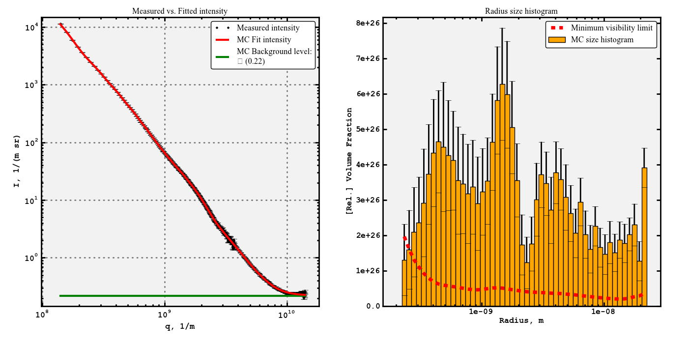
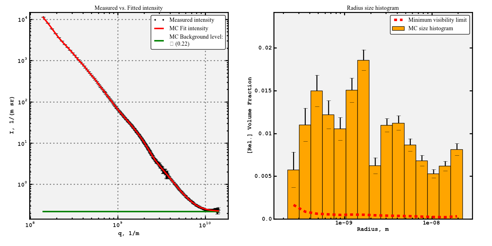
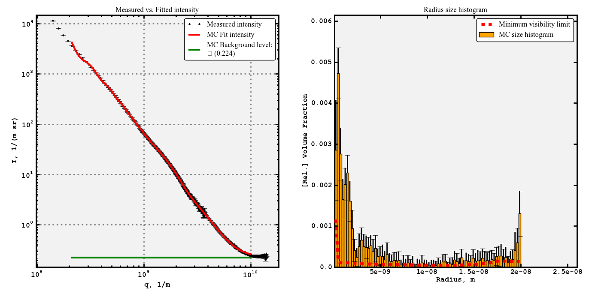

.. Find the reST syntax at http://sphinx-doc.org/rest.html

***********************
McSAS Quick Usage guide
***********************

Introduction
============

This guide is intended as an aid to getting the first fits using McSAS. 

For comprehensive details of what goes on under the hood, please refer as a 
baseline to the available publications. Additionally, the code is open source, 
and provides the best "documentation" of what actually takes place.

When publishing results using this code, the user is requested to cite either or 
both of the following works:

    Bressler, I, Pauw, B. R, and Thuenemann, A., submitted to J. Appl. Cryst., arXiv:1412.1900

    Pauw, B. R., Pedersen, J. S., Tardif, S., Takata, M. and Iversen, B. B.,
    J. Appl. Cryst. 46 (2013), 365—371.

Scope of the code capabilities
------------------------------

The McSAS code at the moment can:

1. Fit supplied data to a variety of models, with absolute unit support.
2. Graphically show the distributions of selected parameters and associated 
    parameter ranges.
3. Graphical output includes distribution population modes with uncertainties.
4. Output the fit, data, settings, and distributions for further processing.
5. Can be used with or without user interface, using command-line arguments. 

-1. Starting McSAS
================================

McSAS can be used on both Linux / Unix systems (including MacOS X) as well as 
personal computers running Windows. 

On Unix- and Unix-like computers, McSAS can be started from any terminal by typing: 
	$ /path/to/mcsas/main.py

On Windows, the compiled executable can be double-clicked to start. 

0. Loading test data
====================

A demonstration dataset has been simulated using SASFit, and output in a 
three-column file "McSAS_demo1.csv"

The dataset can be loaded by right-clicking in the empty list in the 
"Data Files"-tab. 
When loaded, the list shows some information of the data: its length, content, 
q-limits, and scatterer radius limits calculated using the Q limits 
(theoretically, the spacing between Q-points also dictates the size limits, but
the tendency of users to use much too narrowly-spaced Q-points would result in 
unworkable estimates).

Lastly, the "log"-window shows how many datapoints had an uncertainty estimate 
below 1% of the intensity. These datapoint uncertainty values have been adjusted
to 1%, as that is a practically demonstrated limit of SAS data accuracy. 

1. Configuring the algorithm 
====================
The algorithm uses several internal parameters. Some of these can be adjusted 
in the "Algorithm"-tab of the user interface. They are: 
  1. The convergence criterion. If the uncertainty estimates provided with the 
  data are not accurate, or if the fitting model chosen is unsuitable or 
  incompletely descriptive, the algorithm may not arrive at a final solution
  (a convergence criterion of 1 or below). 

If necessary, the other internal parameters can be changed through careful 
editing of the "McSASParameters.json" parameter dictionary. This should not 
be needed for common use. 

2. Plotting the result
======================

The result can be visualised using the built-in plotting function, which puts the data, its fit and the resulting size distribution alongside one another. This can be automatically started by using the option Plot=True in the Analyze_1D code, but can also be run separately. To plot, simply type::

    McPlot(q,I,E,Result)

Which should give you the plot shown in *test_data.pdf*:

The left-hand plot shows the data in black with error bars showing the uncertainty "E", the MC fit in red, and a green line indicating the fitted background level. The width of the green line also serves to indicate the fitting limits in q, and the background value is furthermore indicated in the legend.

The right-hand plot shows the resulting volume-weighted size histogram, with uncertainties on the bars, and the red dashed line indicating the minimum level required for each bin to contribute a measurable amount (i.e. more than the uncertainty) to the scattering pattern.

As is clear from the vertical axis on that plot, the partial volume fractions are unrealistic if the scattering contrast has not been set. One may also want to rebin the plot in fewer bins to reduce the relative uncertainties on the bins.

3. Rebinning the result
=======================

These things can be achieved through rebinning of the result. The rebinning process takes similar arguments as Analyze_1D, and we can thus rebin and replot using (with empty line delimiting the for-loop)::

    B = observability3(q, I, E, Rrep = Result['Rrep'], Rpfactor = 0.5,
                       Histbins = 15, Histscale = 'log', drhosqr = 1.0e29)
    
    #copy all content of the result of observability3 to the output matrix
    for keyname in B.keys():
        Result[keyname] = B[keyname]
        McPlot(q, I, E, Result)

This should give the following figure (as shown in *test_data_plot2.pdf*):

This plot shows more reasonable values for the relative volume fraction, the total volume fraction can be calculated from the 100 repetitions using::

    numpy.mean(Result['Vft'])

which should result in about 15%.

3.5 Everything in one step
==========================

If you have a reasonable idea about what you want to do:

1. fit to within a chi-squared of 5.
2. Only 25 repetitions
3. Radius size bounds of [1e-10,2e-8] (it is not recommended to use '0' as starting point especially when using log-scaled histogram bins, but also because such sized scatterers are unphysical)
4. q-limits between 2e8 and 1e10 reciprocal meters (0.2 and 10 reciprocal nanometers or 0.02 and 1 reciprocal ångström)
5. A scattering contrast of :math:`5 \cdot 10^{29} m^{-2}`
6. 80 bins, linearly scaled
7. using 100 sphere contributions

(there are more options but I am running out of ideas here:)
Then you can do this in one step (with plotting) using::

    Result = Analyze_1D(q, I, E, Convcrit = 5., Nreps = 25,
                        Bounds = [1e-10, 2e-8], qlims = [2e8, 1e10],
                        drhosqr = 5.0e29, Histbins = 80,
                        Histscale = 'lin', Nsph = 100, Plot = True)

Which returns a plot that looks a little wonky (given the low convergence criterion restrictions (the higher Convcrit, the more relaxed the criterion). But is otherwise perfectly valid (*test_data_plot3.pdf*):

4. Exporting the result
=======================

At this point it may be a good idea to get the histogram data out of python and into another plotting program. You can export whatever information you want, but to get a useful set of four columns indicating left bin edge, bin width, bin value (height) and bin uncertainty (standard deviation), you can use::

    McCSV('hist.csv', Result['Hx'], Result['Hwidth'], Result['Hmean'], Result['Hstd'])

Which writes just that to a file named *hist.csv*, semicolon delimited. It actually contains one more bin edge, which is the trailing edge and is superfluous.

5. What's next?
===============

If you have the ability and interest in improving the code, please consider joining the development effort, which will work on making the code object-oriented, including more shapes besides spheres, and adding slit-smearing options.

If you have more questions that are not answered in either 1) the paper, 2) the code, and 3) this document, feel free to send me an e-mail which you can find on the http://lookingatnothing.com/ weblog.

Good luck!

.. vim: set ts=4 sts=4 sw=4 tw=0:
